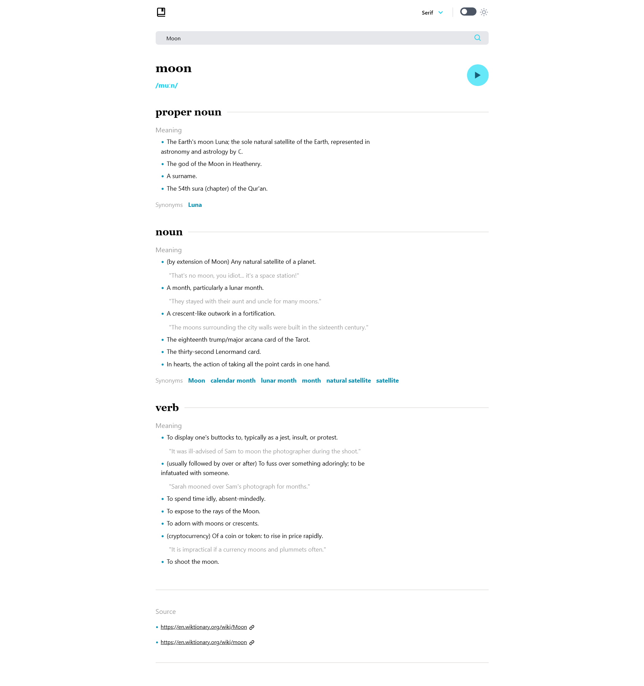
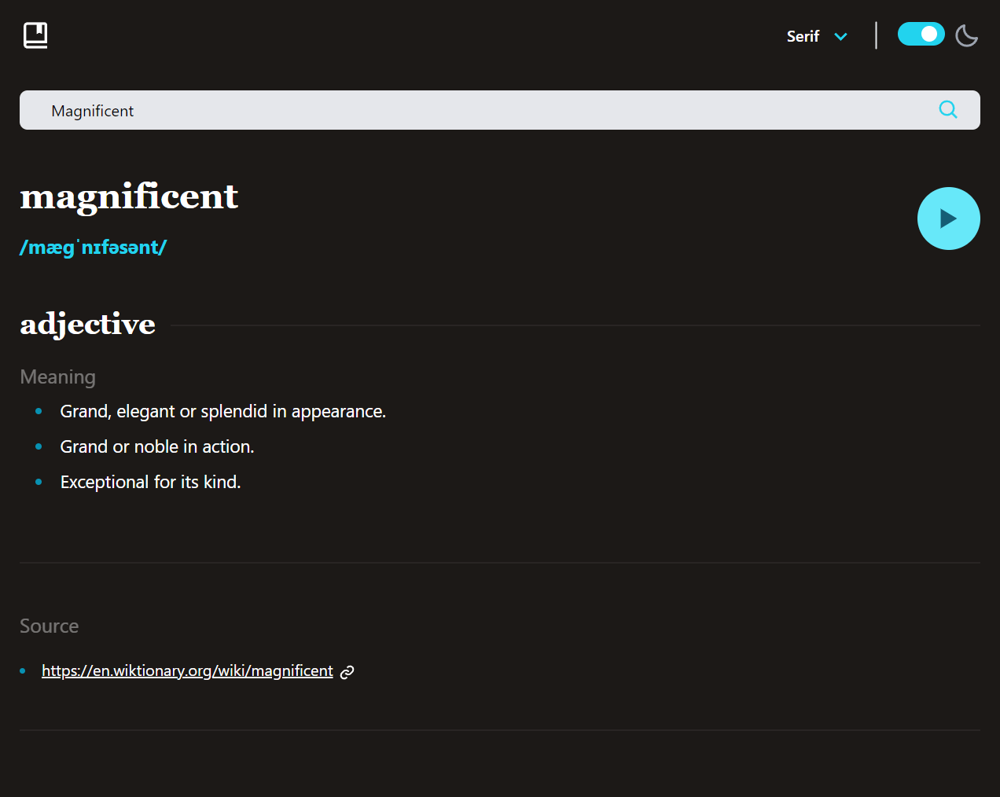

# Dictionary App

This is a solution to [Dictionary Web App](https://www.frontendmentor.io/challenges/dictionary-web-app-h5wwnyuKFL) challenge in [Frontend Practice](https://www.frontendpractice.com/) by recreating a **real website** from **real company**.

In this **Dictionary App** user can search for words meaning and listen to the correct word pronunciation.

## Table of contents

- [Overview](#overview)
  - [Features](#features)
  - [Screenshot](#screenshot)
  - [Links](#links)
  - [Setup](#setup)
- [My process](#my-process)
  - [Built with](#built-with)
- [Author](#Author)

## Overview

### Features

**Users should be able to:**

- View the optimal layout for the site depending on their device's screen size 💻/ 📱
- Search any English word 📙
- See word noun, verb, interjection meanings and source 🔗
- Dark and Light Theme 🎨
- Animation spin 🎞️

### Screenshot




### Links

- Live Site URL: [Here](https://dictionary-app-rose.vercel.app/)
- GitHub URL: [Here](https://github.com/MohanadOO/dictionary-app)

### Setup

Using yarn 👇

```
$ yarn
$ yarn dev
```

Using NPM👇

```
$ npm install
$ npm run dev
```

## My process

### Built with

- [React](https://reactjs.org/) - JS library
- [Tailwind CSS](https://tailwindcss.com/) - CSS framework
- [React Icons](https://react-icons.github.io/react-icons/) - React icons provides a huge collections of icons from different sources.

## Author

- Website - [Mohanad Portfolio](https://www.mohanad.in/)
- Twitter - [@MohanadOO\_](https://twitter.com/MohanadOO_)
